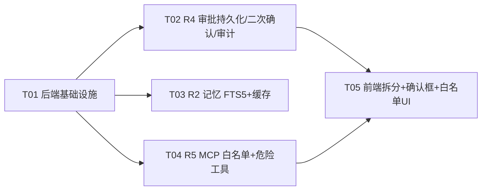

# 中等投入档 5 项改造 — 增量系统设计（高见远 / Architect）

> 设计时间：2026-08-25
> 上游输入：[ARCH_REVIEW.md](./ARCH_REVIEW.md)（评审）、[PRD_MEDIUM_TIER.md](./PRD_MEDIUM_TIER.md)（产品需求）
> 已拍板决策（用户确认，直接纳入设计）：
> - **决策 A（R4 前置 #23）**：启动时若无 `AGENT_API_KEY` 则自动生成随机 key，控制台/启动日志提示；auth 中间件无条件挂载，无鉴权请求必须 401/403（默认环境也强制鉴权）。
> - **决策 B（R5 存量策略）**：全量 fail-closed —— 所有未配置 `allowedTools` 的 MCP 服务器（含存量 6 条）连接后不暴露任何工具。
> - **决策 C（R2 tokenizer）**：主 FTS5 表 `unicode61`（英文/标签预筛）+ 辅助 FTS5 表 `trigram`（中文子串预筛）+ 2 字中文 `LIKE` 兜底；应用层精排保留（见 §1.2 实测依据）。
> - **决策 D（R3 requestId 传递）**：`AsyncLocalStorage`（Node v22 原生支持，业务代码无感），不用显式传参。
> - **决策 E（R4 持久化位置）**：SQLite 新表 `app_settings(key,value)`，与现有 DB 一致，不引入 JSON 配置。

---

## 0. 技术基线核实（探查结论）

| 项 | 结论 | 依据 |
|---|---|---|
| better-sqlite3 | `^13.0.3`，内置 SQLite **3.53.4** | `backend/package.json` + 实测 |
| FTS5 编译 | ✅ `ENABLE_FTS5` 已编译 | 实测 `pragma_compile_options` |
| `unicode61` tokenizer | ✅ 可用 | 实测建表成功 |
| `trigram` tokenizer | ✅ 可用 | 实测建表成功 |
| Node.js | `v22.22.2` | 实测，原生支持 `AsyncLocalStorage`/`randomBytes` |
| 测试基线 | 前端 113 用例 / 后端 154 用例 / 双端 tsc 0 错误 | 评审快速档交付记录 |
| 后端运行方式 | `tsx` 运行时（dev/start/test 均 tsx） | `backend/package.json` |
| 后端测试框架 | `node:test` + `--import tsx` + `AGENT_DB_PATH=:memory:` 隔离 | `tests/helpers/preload.mjs` |
| 现有 migration | 无统一入口，`database.ts` L46-85 散落 try/catch ALTER | 需抽公共 `migrate()`（PRD §6 跨项约束） |

**结论：零新依赖可完成全部 5 项改造。** FTS5 由 better-sqlite3 内置提供，requestId 用 Node 内置 ALS，随机 key 用 Node 内置 `crypto.randomBytes`，审计复用现有 `audit_logs` 表。

---

## 1. 实现方案与框架选型（R1~R5）

### R1. AgentChat.tsx / Settings.tsx 单文件拆分（纯重构）

**难点**：1049 行 / 1157 行单文件、15+ 受控状态与 SSE 流式逻辑耦合，拆分时必须保证零行为回归、`App.tsx` 引用与 props 不变、既有测试（`AgentChat.test.tsx` / `Settings.test.tsx` 以 `../AgentChat`、`../Settings` 引用）不动。

**方案**：**容器组件 + 子组件目录**。不引入状态管理库（PRD 非目标），采用"状态留在容器、纯展示 JSX 下沉"的分层：
- `src/components/AgentChat.tsx` **保留**为容器：持有全部 state、SSE/审批/搜索/轨迹 handlers、虚拟滚动；JSX 中 Header（L634-724）、工具面板（L744-763）、搜索面板（L766-805）、消息列表（L808-838）、审批卡（L864-891）、输入区（约 L930-970）分别替换为子组件引用。文件末尾继续 `export function AgentChat`（命名导出不变，`App.tsx` L4/L71 零改动）。
- 新目录 `src/components/chat/`：`ChatHeader.tsx`、`ChatMessageList.tsx`（内含 `MessageRow` memo 化，顺带兑现评审 #10）、`ChatInput.tsx`、`ToolApprovalCard.tsx`、`ChatSearchPanel.tsx`、`ToolsBadgePanel.tsx`。
- `LiveStats`/`ElapsedBadge`（L1001/L1030）保持原位置不动（自 tick 组件与主组件解耦，移动无收益，减少 diff）。

`Settings.tsx` 同理：`Settings` 保留为容器（sections 数组 L129 + `activeSection` + `renderContent` L644），六个 `renderXxxSection` 函数体（L232/L272/L361/L418/L668/L977）平移为 `src/components/settings/` 下六个独立组件：`ThemeSection` / `LanguageSection` / `GeneralSection` / `KnowledgeSection` / `PromptsSection` / `ShortcutsSection`。各分区自带的 state（themePref/accentColor/shortcutBindings/langPref/general/docs/prompts/ragConfig 等）随 JSX 一并下沉到对应子组件，写入时机（写 localStorage）不变。`Settings.test.tsx` 的 `vi.mock('../../api/client')` 对子组件同样生效（同一模块），测试零改动。

**约束**：
- 除移动/拆分与等价改写（提取变量、拆分三元）外，禁止任何行为/文案/样式改动；`git diff` 需逐行 review。
- `Settings` 被 `App.tsx` 以 lazy + `m.Settings` 引用（`App.tsx` L15），子目录组件不得改变该导出形状。

### R2. 全局记忆检索 FTS5 化 + LIMIT 预筛 + TTL 缓存

**难点**：`localMemoryProvider.search()`（`memory/local.ts` L83-99）当前 `SELECT * FROM global_memories` 全表 + 内存打分，记忆量增长线性劣化；且 PRD 要求"检索质量不降质"，而 FTS5 默认分词对中文不友好（PRD Q-R2-1）。

**实测依据（已探查）**：SQLite 3.53.4 同时支持 `unicode61` 与 `trigram`。
- `unicode61`：英文按词切分（`content`/`tags` 可精确 MATCH），中文连续串被当成**一个 token**，`MATCH '开会'` 匹配不到"今天下午三点开会"。
- `trigram`：任意 3 字符子串可 MATCH，中文/英文子串检索都行，但要求查询串 ≥3 字符、索引体积约为内容 3 倍。

**选型决策（决策 C）**：双 FTS5 外部内容表 + 三层预筛 + 既有精排：

```
候选集预筛（LIMIT 100，三路取并集）：
  1) 英文词/标签            → global_memories_fts        (unicode61, MATCH "word")
  2) 中文（CJK 串长度 ≥3）  → global_memories_fts_trigram (trigram, MATCH 原串)
  3) 中文（CJK 串长度 <3）  → LIKE 子串兜底（LIMIT 100 截断，已知最小化例外）
→ 去重后取候选行 → 复用现有 tokenize + score 精排 → topK
```

- 建表/触发器：`global_memories_fts` 与 `global_memories_fts_trigram` 均声明 `content='global_memories'`（external content，`content_rowid='rowid'`），用 6 个 `AFTER INSERT/UPDATE/DELETE` 触发器同步（FTS5 external content 删除必须走特殊 `'delete'` 命令，否则 orphan）。写路径（`add`/`update`/`remove`）由触发器自动维护，**业务代码无需显式双写**。
- 存量回填：migration v2 启动校验 FTS 行数 < 主表行数则全量重建（`INSERT INTO fts(fts) VALUES('rebuild')` 不可用于 external content，需按行 `'delete'+'insert'` 回填，见 §3.1）。
- TTL 缓存：`memory/fts.ts` 内 `Map<queryKey, {ts, results}>`，TTL 60s 硬编码（PRD Q-R2-2 默认）；`add/update/remove` 时 `cache.clear()` 保证无脏读。
- 质量兜底：预筛召回上限 100 条，精排逻辑（`local.ts` L7-20 tokenize/score，标签加权 1.5）**原样保留**，中文/标签效果不回退。
- 接口不变：`MemoryProvider.search()` 签名、`registry.ts` 跨源合并（`searchAllMemories`）、`memory/tools.ts`、`routes/memory.ts`、`agent/core.ts` L169-170 调用点全部零改动。

**性能预期**：英文/标签/中文≥3 字符主路径全部走 FTS 索引（不再全表扫描）；仅 2 字中文查询走 LIKE 截断（低频、记忆量万级可控）。

### R3. 日志链路统一 requestId + 错误脱敏

**难点**：console 与 logger 混用（实测 12 处 `console.*`，其中 logger.ts 内部 2 处 + 注释 2 处豁免，实际需收敛 8 处）；错误响应体与错误日志不脱敏；无统一请求上下文。

**方案**：
- **requestId 传递：`AsyncLocalStorage`（决策 D）**。新建 `utils/request-context.ts`：`runWithRequest(fn)` / `getRequestId()`。Express 中间件在**最前**挂载（rateLimit 之前）：生成 `randomUUID()`，`runWithRequest` 包裹 `next()`，同时写响应头 `X-Request-Id`（用 `res.on('finish')` 或直接 `res.setHeader` 兜底）。所有 `logger.*` 自动携带（`logger.ts` `format()` 从 ALS 读 requestId）。
- **logger 改造**：`utils/logger.ts` L10-13 `format()` 增加 `rid` 段（无则省略，保持既有输出格式兼容）；`logError`（`error-mask.ts` L12-15）保持不变（已脱敏）。
- **console 收敛清单**（8 处，全部替换为 `logger.*`）：
  - `agent/core.ts` L605 → `logger.warn`；L837/L905/L917 → `logger.error`
  - `mcp/manager.ts` L149/L226 → `logger.error`
  - `shared/json-store.ts` L24 → `logger.error`
  - `routes/plugins.ts` L64 → `logger.error`
  - 豁免：`utils/logger.ts` L19/L21（logger 自身实现）、`agent/hooks.ts` L56 与 `workflow/graph.ts` L26（注释）。
- **错误脱敏**：统一错误处理中间件（`server.ts` L134-137）改用 `safeErrorMessage(_err.message)` 输出；`POST /agent/test-openai` 等路由错误分支已有 `logError` 的保持，缺脱敏的补 `safeErrorMessage`。
- **入口/出口日志（P1）**：requestId 中间件内记录 `method path status duration`，受 `LOG_REQUESTS`（默认关闭，`LOG_LEVEL=info` 时开启）控制。
- **前端（P1 最小实现）**：`api/client.ts` 响应拦截器读 `X-Request-Id`，失败时 `error.message` 附带 `(requestId: xxx)`；SSE 路径在 `streamAgentEvents`（L255-307）catch 处同样附带。
- **回归保障**：健康检查（`/api/health`）在 requestId 中间件覆盖范围内（中间件挂全 app 而非仅 `/api`），AC-R3-4 满足。

### R4. 审批全局开关安全加固 + 前置 #23（默认随机 API key）

**难点**：当前开关是 `tools/registry.ts` L118 内存变量 `let approvalRequired = true`，`agent.ts` L206-214 无鉴权可改、重启丢失；`server.ts` L64/L73 在无 `AGENT_API_KEY` 时 auth 中间件**不挂载**（默认裸奔）。

**方案**：
- **前置 #23（决策 A）**：`server.ts` 启动 `ensureApiKey()`——`AGENT_API_KEY` 有值则用之；否则 `randomBytes(24).toString('hex')` 生成 `agent-<hex>`，`logger.warn` + 控制台醒目打印。authMiddleware **无条件挂载**（删 `if (API_KEY)` 条件），`SKIP_AUTH` 默认仍为 `/api/health`。由此"无鉴权请求必须失败"在**默认环境也成立**。
  - 已知 UX 影响：随机 key 每次启动变化，前端 Settings 存过旧 key 会 401——前端收到 401 时提示"后端已启用鉴权，请在 Settings 填入启动日志中的 AGENT_API_KEY"（见 §8 待明确 S4）。
- **持久化**：新表 `app_settings(key TEXT PRIMARY KEY, value TEXT NOT NULL, updated_at TEXT)`（schema.ts）；新模块 `db/settings.ts` 提供 `settingsStore.get<T>(key, default)` / `settingsStore.set(key, value)`（读写 JSON value，内存缓存 + 即时落库）。`registry.ts` 启动时 `approvalRequired = settingsStore.get('approval.required', true)`；`setApprovalRequired(v)` 落库 + 更新内存。
- **二次确认**：`POST /api/agent/settings/approval`（`agent.ts` L206-214）改造——`enabled === false` 时必须携带 `confirm: true`，否则 400 且不改状态；`enabled === true` 无需 confirm（打开是安全方向）。
- **审计**：复用 `audit_logs` 表（schema.ts L52-62，`permission` CHECK 对 NULL 放行），`event_type='approval_toggle'`：`input` 存 `{enabled, confirm, actor: requestId + req.ip}`，`output` 存 `{from, to, result}`；成功与失败尝试都记录（失败尝试 `result:'rejected'`）。
- **鉴权**：由全局 auth 中间件覆盖（`/api/agent/*` 非 SKIP_AUTH），无需路由内重复校验；二次确认是第二道防线（PRD P1"双保险"）。
- **前端（P1）**：Settings GeneralSection 新增"审批要求"开关（当前前端无该开关 UI，需补），关闭时弹确认对话框（window.confirm 或内置 dialog），确认后带 `confirm:true` 调 POST；AgentChat 审批卡流程不变。
- **测试落点**：`core-routes.test.ts` 增：无鉴权 POST → 401 且值不变；`{enabled:false}` 无 confirm → 400；带 confirm → 200 且 `audit_logs` 新增 `approval_toggle`；重启进程（内存库重连）后 GET 返回持久化值。

### R5. MCP 工具白名单 + 危险工具强制审批

**难点**：`mcp/manager.ts` connect() L83-115 把 `listTools()` 结果**全量**注册进 `toolRegistry`（`requiresApproval: true` 硬编码 L112），无 per-tool 白名单；全局开关关闭后可绕过审批。

**方案**：
- **配置模型**：`McpServerConfig`（`mcp/store.ts` L13-24）增加 `allowedTools?: string[]`（存 `mcp__<server>__<tool>` 全名）；`routes/mcp.ts` POST 接收、新增 `PUT /:id` 更新（含 allowedTools/autostart/enabled），已连接时提示需重连生效。
- **白名单过滤（决策 B 全量 fail-closed）**：`manager.ts` connect() 注册循环前计算 `allowedSet = new Set(config.allowedTools ?? [])`：
  - `allowedSet.size === 0` → **不注册任何工具**（fail-closed，含存量 6 条）；
  - 否则仅注册 `allowedSet.has(registeredName)` 的工具，白名单外工具不注册（LLM 不可见、`executeTool` 返回 `TOOL_NOT_FOUND`）。
- **危险工具判定模块（新 `tools/dangerous.ts`）**：名称模式启发式，`isDangerousToolName(name)` 返回 boolean、`classifyDanger(name)` 返回 `'file_write' | 'shell_exec' | null`：
  - 文件写：`write|save|create|append|delete|remove|edit|rename|move|mkdir|upload|rm\b`
  - shell 执行：`exec|run|command|shell|terminal|bash|zsh|powershell|cmd|sh\b|spawn|execute`
  - 误伤接受（PRD Q-R5-2："宁可多审批"）。
- **两层审批门（`tools/registry.ts` executeTool L155-171 改造）**：`ToolDefinition` 增加 `dangerous?: boolean`；MCP 注册时 `dangerous = isDangerousToolName(registeredName) || isDangerousToolName(tool.name)`。审批判定改为：
  ```
  const mustApprove = approvalRequired || tool.dangerous === true;
  if (tool.requiresApproval && mustApprove) { …现审批门逻辑不变… }
  ```
  即：**全局开关关闭时，非危险工具可豁免；危险工具（dangerous=true）仍强制审批**，返回 `PENDING_APPROVAL`。
  - **范围约束**：`dangerous` 字段只在 MCP 注册路径写入；内置工具不自动打标（`builtin.ts` 等零改动），确保"既有非 MCP 内置工具审批行为不变"（PRD AC-R5-4）。危险判定函数未来可复用于 terminal 等域（评审遗留项①），但本批不扩大范围。
- **面板/路由增强（P1）**：`GET /api/mcp/:id/tools` 返回每个工具的 `allowed / dangerous / forcedApproval` 标记；`McpPanel.tsx` 展示勾选白名单（新增 PUT 调用）与"被拦截/强制审批"徽标。
- **测试落点**：`tests/mcp.test.ts` fixture 带 `allowedTools` 重连断言（白名单外不可执行、fail-closed 空暴露、危险不可豁免、disconnect 反注册）。

---

## 2. 文件清单（新增/修改，精确到落点）

### T01 后端基础设施（migration 入口 + app_settings + requestId + 默认鉴权 + console 收敛）

| 文件 | 类型 | 改动要点 |
|---|---|---|
| `backend/src/db/schema.ts` | 修改 | `SCHEMA_SQL` 追加 `app_settings(key TEXT PRIMARY KEY, value TEXT NOT NULL, updated_at TEXT DEFAULT (datetime('now')))`（追加在 audit_logs 之后即可） |
| `backend/src/db/database.ts` | 修改 | 新增 `MIGRATIONS: {version, up}[]` + `migrate(db)`（用 `PRAGMA user_version`），把 L46-85 散落 ALTER 收拢为 version 1；`getDb()` 初始化末尾调 `migrate(db)` |
| `backend/src/db/settings.ts` | **新增** | `settingsStore.get<T>(key, fallback)` / `settingsStore.set(key, value)`（内存缓存 + 即时写 app_settings；JSON 序列化 value） |
| `backend/src/utils/request-context.ts` | **新增** | `runWithRequest(fn)` / `getRequestId()`，基于 `AsyncLocalStorage<string>` |
| `backend/src/utils/logger.ts` | 修改 | L10-13 `format()` 读 `getRequestId()` 拼 `[rid=xxx]` 段（无则省略）；导出 `logger` 不变 |
| `backend/src/server.ts` | 修改 | ① 新增 `ensureApiKey()`（`randomBytes` + 控制台打印，置于 L42 dotenv 后）；② requestId 中间件挂在 `app.use(limiter)`（L55）之前，设置 `X-Request-Id` 响应头并记录 `LOG_REQUESTS` 入口/出口日志；③ L58-73：`API_KEY = ensureApiKey()`、authMiddleware 无条件 `app.use('/api', authMiddleware)`；④ L134-137 错误处理中间件改用 `safeErrorMessage` |
| `backend/src/utils/error-mask.ts` | 修改（可选） | 不变亦可；建议 `logError` 保持原样（已满足） |
| `backend/src/agent/core.ts` | 修改 | L605 → `logger.warn`；L837/L905/L917 → `logger.error` |
| `backend/src/mcp/manager.ts` | 修改 | L149/L226 → `logger.error`（其余 console 收敛） |
| `backend/src/shared/json-store.ts` | 修改 | L24 → `logger.error` |
| `backend/src/routes/plugins.ts` | 修改 | L64 → `logger.error` |
| `backend/tests/request-context.test.ts` | **新增** | requestId 中间件：响应头存在、日志带 rid、错误响应脱敏（含 `api_key=sk-xxx` / Bearer / 32+ 位密钥） |
| `backend/tests/core-routes.test.ts` | 修改 | 增加默认鉴权用例：无 `AGENT_API_KEY` 时也 401（注入随机 key 场景） |

### T02 审批持久化 + 二次确认 + 审计（R4）

| 文件 | 类型 | 改动要点 |
|---|---|---|
| `backend/src/tools/registry.ts` | 修改 | L118 注释保留但改为 `let approvalRequired = settingsStore.get('approval.required', true)`（模块加载时读）；L137-139 `setApprovalRequired` 增加 `settingsStore.set('approval.required', value)`；新增 `logApprovalToggle(prev,next,actor,result,note)` 写 `audit_logs`（`event_type='approval_toggle'`，复用 L190-204 模式） |
| `backend/src/routes/agent.ts` | 修改 | L202-214：GET 不变；POST 增加 `confirm` 校验（`enabled===false && confirm!==true` → 400 且不改）；成功/失败均 `logApprovalToggle`（actor=`getRequestId() + req.ip`）；新增 `GET /settings/approval/audit?limit=`（P2，可选） |
| `backend/tests/core-routes.test.ts` | 修改 | 增 R4 用例：401/400/200 + 审计记录断言 + 持久化断言 |
| `backend/src/db/settings.ts` | 复用（T01） | 无改动 |
| `backend/src/db/schema.ts` | 复用（T01） | `audit_logs` 表已存在，无需改 |

### T03 记忆检索 FTS5 + 预筛 + TTL 缓存（R2）

| 文件 | 类型 | 改动要点 |
|---|---|---|
| `backend/src/db/schema.ts` | 修改 | 追加 `global_memories_fts`（external content, unicode61, content+tags）、`global_memories_fts_trigram`（external content, trigram, content）两张虚拟表 + 6 个触发器（INSERT/UPDATE/DELETE，DELETE 用 `'delete'` 命令，UPDATE 先 delete 后 insert） |
| `backend/src/db/database.ts` | 修改 | `MIGRATIONS` 增加 version 2：FTS 表缺失则建表 + 全量回填（`SELECT rowid, content, tags FROM global_memories` 逐行 `'delete'+'insert'`）；每次启动校验 FTS 行数 < 主表行数则重建 |
| `backend/src/memory/fts.ts` | **新增** | `rebuildFtsIndex()` / `searchCandidateIds(query, limit=100): string[]`（三路预筛并集，MATCH 词用 `"token"` 双引号包裹转义）/ `invalidateMemoryCache()` / TTL 缓存 `getCachedSearch/putCachedSearch`（60s） |
| `backend/src/memory/local.ts` | 修改 | `add` L56-64 / `update` L66-76 / `remove` L78-81 末尾调 `invalidateMemoryCache()`；`search` L83-99 改为：查缓存 → miss 则 `searchCandidateIds` 取候选 → `SELECT * FROM global_memories WHERE id IN (...)` → 既有 tokenize/score 精排（L7-20 保留）→ 写缓存；`list/get` 不变 |
| `backend/tests/memory.test.ts` | 修改 | 新增：英文 MATCH 召回、中文 ≥3 字召回（trigram）、2 字中文兜底、TTL 命中（第二次不重复查询）、add/update/remove 后缓存失效、`global_memories_fts` 行数与主表一致 |

### T04 MCP 白名单 + 危险工具强制审批（R5）

| 文件 | 类型 | 改动要点 |
|---|---|---|
| `backend/src/tools/dangerous.ts` | **新增** | `isDangerousToolName(name)` / `classifyDanger(name)` / 模式常量（见 §1.5） |
| `backend/src/mcp/store.ts` | 修改 | `McpServerConfig` L13-24 增加 `allowedTools?: string[]`；seed（L29-40）不加（fail-closed 默认） |
| `backend/src/mcp/manager.ts` | 修改 | connect() L83-115 注册循环前 `allowedSet = new Set(config.allowedTools ?? [])`；`size===0` 跳过全部（不注册）；否则仅注册 `allowedSet.has(registeredName)`；注册 def 增加 `dangerous: isDangerousToolName(registeredName) || isDangerousToolName(tool.name)`（`requiresApproval: true` 保持）；`statusOf`/`McpConnectionStatus` 增加 `allowedTools` 透出（可选） |
| `backend/src/routes/mcp.ts` | 修改 | POST L17-54 接收 `allowedTools`（校验 string[]）；**新增** `PUT /:id`（更新 allowedTools/autostart/enabled，已连接时返回提示需重连）；GET `/:id/tools` L77-81 增强：每个工具附 `allowed/dangerous/forcedApproval` |
| `backend/src/tools/registry.ts` | 修改 | `ToolDefinition` L44-52 增加 `dangerous?: boolean`；executeTool L155 审批条件改 `tool.requiresApproval && (approvalRequired || tool.dangerous === true)` |
| `backend/tests/mcp.test.ts` | 修改 | fixture 注册带 `allowedTools`；新增：白名单外不注册、fail-closed（无 allowedTools → 0 tools）、危险工具关闭全局审批仍 PENDING_APPROVAL、disconnect 反注册；`statusOf` 标记断言 |

### T05 前端：R1 拆分 + R4 确认框 + R5 白名单 UI + R3 requestId 展示

| 文件 | 类型 | 改动要点 |
|---|---|---|
| `src/components/chat/ChatHeader.tsx` | **新增** | 由 AgentChat L634-724 JSX 平移；props：tools/showTools/onToggleTools/onClear/onFork/sessionId/showSearch/onToggleSearch/showTrajectory/onToggleTrajectory/workflowMode/onToggleWorkflow/fileTrackerEnabled/onToggleFileTracker/trackedFiles/ctxUsage/model/isLoading/contextCompressed |
| `src/components/chat/ChatMessageList.tsx` | **新增** | 消息区 + 虚拟滚动 + TTS 错误 + thinking + 空态（AgentChat L808-849）；内含 `MessageRow`（memo，`renderMessageRow` L132 平移，时间格式化缓存；兑现评审 #10） |
| `src/components/chat/ChatInput.tsx` | **新增** | 输入区 JSX（约 L930-970）：textarea + 发送/停止/AutoRun 按钮；props：input/onChange/onKeyPress/isLoading/onSend/onStop/autoRun/onToggleAutoRun/tools |
| `src/components/chat/ToolApprovalCard.tsx` | **新增** | 审批卡 L864-891：pendingApproval/onApprove/onDeny |
| `src/components/chat/ChatSearchPanel.tsx` | **新增** | 搜索面板 L766-805：searchQ/onSearch/searching/results/onClear |
| `src/components/chat/ToolsBadgePanel.tsx` | **新增** | 工具面板 L744-763（可选合并进 ChatHeader，二选一） |
| `src/components/AgentChat.tsx` | 修改 | 瘦身为容器：state/handlers 保留，JSX 区块替换为子组件；`export function AgentChat` 不变（App.tsx L4/L71 零改动）；LiveStats/ElapsedBadge 保留原位 |
| `src/components/settings/ThemeSection.tsx` | **新增** | `renderThemeSection` L272-360 平移 + 自带 state（themePref/accentColor） |
| `src/components/settings/LanguageSection.tsx` | **新增** | L232-271 平移 |
| `src/components/settings/GeneralSection.tsx` | **新增** | L418-643 平移 + **新增审批开关**（GET/POST `/api/agent/settings/approval`，关闭时确认对话框带 confirm:true，R4 P1） |
| `src/components/settings/KnowledgeSection.tsx` | **新增** | L668-976 平移（docs/ragConfig/kb state 下沉） |
| `src/components/settings/PromptsSection.tsx` | **新增** | L977-1097 平移（prompts state 下沉） |
| `src/components/settings/ShortcutsSection.tsx` | **新增** | L361-417 平移 |
| `src/components/Settings.tsx` | 修改 | 保留容器：sections + activeSection + renderContent 分发；六分区 render 替换为子组件；`export function Settings` 不变（App.tsx L15 lazy 引用零改动） |
| `src/api/client.ts` | 修改 | axios 响应拦截器读 `X-Request-Id`（成功 logger.info、失败 error.message 附带 requestId）；`streamAgentEvents` L302-307 catch 附带 |
| `src/components/McpPanel.tsx` | 修改 | 服务器卡片显示工具白名单勾选（保存走 `PUT /api/mcp/:id`）+ 被拦截/强制审批徽标（读 `GET /api/mcp/:id/tools` 增强字段） |
| `src/components/__tests__/AgentChat.test.tsx` | 不变（验证） | 引用路径不变，作为零回归门禁 |
| `src/components/__tests__/Settings.test.tsx` | 不变（验证） | 同上 |
| `src/components/chat/__tests__/MessageRow.test.tsx` 等 | **新增（P1 可选）** | 子组件单测（MessageRow 渲染、ToolApprovalCard 交互） |

---

## 3. 数据结构与接口

### 3.1 FTS5 表 schema（R2）

```sql
-- 主表：英文/标签预筛（unicode61）
CREATE VIRTUAL TABLE IF NOT EXISTS global_memories_fts USING fts5(
  content,
  tags,
  content='global_memories',
  content_rowid='rowid',
  tokenize='unicode61'
);
-- 辅助表：中文/任意子串预筛（trigram，查询串需 ≥3 字符）
CREATE VIRTUAL TABLE IF NOT EXISTS global_memories_fts_trigram USING fts5(
  content,
  content='global_memories',
  content_rowid='rowid',
  tokenize='trigram'
);

-- 同步触发器（external content 表删除必须走 'delete' 命令）
CREATE TRIGGER IF NOT EXISTS trg_mem_fts_insert AFTER INSERT ON global_memories BEGIN
  INSERT INTO global_memories_fts(rowid, content, tags) VALUES (new.rowid, new.content, new.tags);
  INSERT INTO global_memories_fts_trigram(rowid, content) VALUES (new.rowid, new.content);
END;
CREATE TRIGGER IF NOT EXISTS trg_mem_fts_delete AFTER DELETE ON global_memories BEGIN
  INSERT INTO global_memories_fts(global_memories_fts, rowid, content, tags) VALUES('delete', old.rowid, old.content, old.tags);
  INSERT INTO global_memories_fts_trigram(global_memories_fts_trigram, rowid, content) VALUES('delete', old.rowid, old.content);
END;
CREATE TRIGGER IF NOT EXISTS trg_mem_fts_update AFTER UPDATE ON global_memories BEGIN
  INSERT INTO global_memories_fts(global_memories_fts, rowid, content, tags) VALUES('delete', old.rowid, old.content, old.tags);
  INSERT INTO global_memories_fts(global_memories_fts, rowid, content, tags) VALUES('insert', new.rowid, new.content, new.tags);
  INSERT INTO global_memories_fts_trigram(global_memories_fts_trigram, rowid, content) VALUES('delete', old.rowid, old.content);
  INSERT INTO global_memories_fts_trigram(global_memories_fts_trigram, rowid, content) VALUES('insert', new.rowid, new.content);
END;
```

重建（migration v2 / 启动自愈）：`SELECT rowid, content, tags FROM global_memories` 逐行执行 `'delete'` 后 `'insert'`；external content 表**不可用** `INSERT INTO fts(fts) VALUES('rebuild')`。

预筛（`memory/fts.ts` `searchCandidateIds` 伪代码）：

```
function searchCandidateIds(query, limit = 100):
  ids = Set<string>
  words = tokenize(query).filter(ascii)                    // 英文词
  if words.length:
    match = words.map(w => `"${w.replace(/"/g,'""')}"`).join(' OR ')
    rows = db.prepare(`
      SELECT gm.id FROM global_memories gm
      JOIN global_memories_fts f ON f.rowid = gm.rowid
      WHERE global_memories_fts MATCH ? LIMIT ?`).all(match, limit)
    ids.add(rows.id...)
  cjk = (query.match(/[\u4e00-\u9fff]+/g) || []).join('')
  if cjk.length >= 3:
    rows = db.prepare(`
      SELECT gm.id FROM global_memories gm
      JOIN global_memories_fts_trigram f ON f.rowid = gm.rowid
      WHERE global_memories_fts_trigram MATCH ? LIMIT ?`).all(cjk, limit)
    ids.add(rows.id...)
  else if cjk.length > 0:                                   // 1-2 字中文兜底（已知例外）
    rows = db.prepare(`SELECT id FROM global_memories
      WHERE content LIKE ? OR tags LIKE ? LIMIT ?`).all(`%${cjk}%`, `%${cjk}%`, limit)
    ids.add(rows.id...)
  return [...ids].slice(0, limit)
```

### 3.2 app_settings 表（R4）

```sql
CREATE TABLE IF NOT EXISTS app_settings (
  key TEXT PRIMARY KEY,
  value TEXT NOT NULL,               -- JSON 序列化值
  updated_at TEXT DEFAULT (datetime('now'))
);
-- 首个键：approval.required → 'true' | 'false'（JSON boolean）
```

### 3.3 mcp_servers.json allowedTools 字段（R5）

```jsonc
{
  "id": "mcp-abc123",
  "name": "Memory",
  "transport": "stdio",
  "command": "npx",
  "args": "-y @modelcontextprotocol/server-memory",
  "autostart": false,
  "enabled": true,
  "createdAt": "2026-08-25T00:00:00.000Z",
  "allowedTools": ["mcp__Memory__search_notes"]   // 新增；缺失 = fail-closed（不暴露任何工具）
}
```

### 3.4 审计日志格式（R4，复用 audit_logs 表）

```
event_type  = 'approval_toggle'
session_id  = NULL
tool_name   = NULL
input       = {"enabled": false, "confirm": true, "actor": "req-<uuid>|127.0.0.1"}
output      = {"from": true, "to": false, "result": "ok" | "rejected", "reason": "missing confirm" | null}
permission  = NULL     -- CHECK(permission IN ('allow','approve','deny')) 对 NULL 放行
duration_ms = NULL
```

### 3.5 executeTool 审批门两层判定（R5，registry.ts L155-171）

```ts
// ToolDefinition 新增字段
interface ToolDefinition {
  // …既有字段…
  /** 危险工具（文件写/shell 执行类）：全局审批关闭时也不可豁免。仅 MCP 注册路径写入。 */
  dangerous?: boolean;
}

// executeTool 审批门（替换 L155 条件）
const mustApprove = approvalRequired || tool.dangerous === true;
if (tool.requiresApproval && mustApprove) {
  // …原审批逻辑（approvalKey/approvalToken/PENDING_APPROVAL）不变…
}
```

**安全断言 → 实现落点对照**：
| 安全断言 | 落点 |
|---|---|
| 无鉴权请求必须 401/403（默认环境） | `server.ts` `ensureApiKey()` + auth 无条件挂载 |
| 审批开关不可被未授权关闭 | 全局 auth 中间件覆盖 `/api/agent/*` |
| 关闭审批需二次确认 | `agent.ts` POST `enabled===false` 需 `confirm:true` |
| 开关重启不丢 | `settingsStore`（app_settings 表） |
| 变更留痕 | `logApprovalToggle` → audit_logs |
| 未配白名单不暴露任何 MCP 工具 | `manager.ts` `allowedSet.size===0` 跳过注册 |
| 危险工具不可豁免 | `dangerous.ts` 判定 + `executeTool` 两层门 |

---

## 4. 程序调用流程

### 4.1 requestId 中间件挂载顺序（R3）

```text
请求 → [1] requestId 中间件（生成 UUID，runWithRequest，响应头 X-Request-Id，LOG_REQUESTS 入口日志）
     → [2] rateLimit（express-rate-limit）
     → [3] auth 中间件（无条件，401 也带 X-Request-Id）
     → [4] cors → [5] express.json/urlencoded
     → [6] 各业务路由（logger.* 自动带 rid）
     → [7] 统一错误处理（safeErrorMessage 脱敏，响应仍带 X-Request-Id）
```

### 4.2 记忆检索新调用链（R2）

```text
agent/core.ts loadGlobalMemories(L164-177)
  └─ searchAllMemories(query, topK*2)            // memory/registry.ts L38-54（不变）
      └─ localMemoryProvider.search(query, topK)  // memory/local.ts L83-99（改造）
          ├─ TTL 缓存命中 → 直接返回
          └─ miss → fts.searchCandidateIds(query, 100)   // 三路预筛并集（见 §3.1）
              → SELECT * FROM global_memories WHERE id IN (...)
              → tokenize + score 精排（标签加权 1.5）→ topK
              → 写缓存（60s）

写入路径（自动维护索引 + 失效缓存）：
  localMemoryProvider.add/update/remove (L56-81)
    └─ SQLite 触发器同步 global_memories_fts / _trigram
    └─ invalidateMemoryCache()
```

### 4.3 审批开关读写链（R4）

```text
GET  /api/agent/settings/approval
  → isApprovalRequired()                // registry.ts L133-135（内存，启动时自 settingsStore 加载）

POST /api/agent/settings/approval {enabled, confirm?}
  → auth 中间件（无鉴权 → 401，审计 result:'rejected'）
  → enabled===false && confirm!==true → 400（审计 result:'rejected'）
  → setApprovalRequired(enabled)        // settingsStore.set('approval.required', enabled) + 内存
  → logApprovalToggle(prev, next, actor, 'ok')
  → res.json({ approvalRequired })

启动时：
  getDb() → migrate(db)（含 app_settings 建表）
  tools/registry.ts 模块加载 → approvalRequired = settingsStore.get('approval.required', true)
```

### 4.4 MCP 连接注册链（R5）

```text
POST /api/mcp/:id/connect
  └─ mcpManager.connect(id)                       // manager.ts L56-119
      ├─ buildTransport → client.connect
      ├─ client.listTools() → toolList
      ├─ allowedSet = new Set(config.allowedTools ?? [])   // fail-closed
      ├─ for tool of toolList:
      │    registeredName = `mcp__${config.name}__${tool.name}`
      │    if allowedSet.size === 0 → continue               // 未配置 → 不暴露
      │    if !allowedSet.has(registeredName) → continue    // 白名单外 → 不暴露
      │    dangerous = isDangerousToolName(registeredName) || isDangerousToolName(tool.name)
      │    toolRegistry.register(registeredName, { schema, handler, category:'mcp',
      │      requiresApproval: true, dangerous, enabled: true })
      └─ connections.set(id, {config, client, toolNames})

执行（LLM/用户调 executeTool）：
  executeTool(name, args, ctx)
    → toolRegistry.get(name) 不存在 → TOOL_NOT_FOUND
    → tool.enabled=false → TOOL_DISABLED
    → mustApprove = approvalRequired || tool.dangerous === true
    → 需审批且无 token → PENDING_APPROVAL（危险工具在全局关闭时仍走此分支）
    → handler(args, ctx) → logAudit('allow'/'deny')
```

---

## 5. 任务列表（有序、含依赖、按实现顺序）

> 约束：≤5 任务；每个任务 ≥3 文件；T01 必须是基础设施。任务间仅 T05 依赖后端接口，T02/T03/T04 均只依赖 T01，可顺序或并行实现。

| ID | 任务名 | 依赖 | 涉及文件（主要） | 优先级 |
|---|---|---|---|---|
| **T01** | 后端基础设施：统一 migration + app_settings + requestId 链路 + 默认随机 API key + console 收敛 | — | `backend/src/db/schema.ts`、`db/database.ts`、`db/settings.ts`(新)、`utils/request-context.ts`(新)、`utils/logger.ts`、`server.ts`、`utils/error-mask.ts`、`agent/core.ts`、`mcp/manager.ts`、`shared/json-store.ts`、`routes/plugins.ts`、`tests/request-context.test.ts`(新)、`tests/core-routes.test.ts` | P0 |
| **T02** | R4 审批持久化 + 二次确认 + 审计 | T01 | `tools/registry.ts`、`routes/agent.ts`、`tests/core-routes.test.ts`（复用 `db/settings.ts`、`db/schema.ts`） | P0 |
| **T03** | R2 记忆检索 FTS5 + 预筛 + TTL 缓存 | T01 | `db/schema.ts`、`db/database.ts`、`memory/fts.ts`(新)、`memory/local.ts`、`tests/memory.test.ts` | P0 |
| **T04** | R5 MCP 白名单 + 危险工具强制审批 | T01 | `tools/dangerous.ts`(新)、`mcp/store.ts`、`mcp/manager.ts`、`routes/mcp.ts`、`tools/registry.ts`、`tests/mcp.test.ts` | P0 |
| **T05** | R1 前端拆分 + R4 确认框 + R5 白名单 UI + R3 requestId 展示 | T02, T04 | `components/chat/*`(新 6 文件)、`components/AgentChat.tsx`、`components/settings/*`(新 6 文件)、`components/Settings.tsx`、`api/client.ts`、`components/McpPanel.tsx`、前端测试 | P0 |

**执行建议**：T01 →（T02 ∥ T03 ∥ T04）→ T05。每个任务完成需跑通对应测试：T01 `npm test`（后端全量）、T02 core-routes、T03 memory、T04 mcp、T05 `npm run test:ui` + 双端 `tsc`。

### 5.1 依赖关系图



---

## 6. 依赖包

**零新依赖。** 依据：
- FTS5/unicode61/trigram：better-sqlite3 ^13.0.3 内置 SQLite 3.53.4（已实测编译可用）；
- requestId 上下文：Node v22 原生 `AsyncLocalStorage`；
- 随机 API key：Node 原生 `crypto.randomBytes`；
- UUID：已有 `uuid` ^14.0.1；
- 前端拆分：纯文件移动，无新依赖（PRD 明确不引入状态管理库）。

---

## 7. 共享知识（跨文件约定，供工程师直接引用）

1. **requestId 获取**：业务代码不直接传参，需要时 `import { getRequestId } from '../utils/request-context.js'`；日志自动携带，无需手动拼。
2. **日志统一入口**：一律 `logger`（`backend/src/utils/logger.ts`）；**禁止新增裸 `console.*`**（T01 收口后，lint/review 把关；logger.ts 内部 2 处为唯一豁免）。
3. **错误脱敏**：错误日志/错误响应一律经 `safeErrorMessage`（`utils/error-mask.ts`）；错误响应体格式保持 `{ error: string }`（既有约定，不新增字段）。
4. **migration 统一入口**：所有表结构变更走 `backend/src/db/database.ts` 的 `MIGRATIONS` + `migrate(db)`（`PRAGMA user_version` 版本化）；**禁止**在其它文件散落 `ALTER TABLE`。
5. **settings 读写**：统一 `settingsStore`（`backend/src/db/settings.ts`），禁止直接 SQL 读写 `app_settings`。
6. **FTS 索引维护**：`global_memories_fts*` 由触发器自动同步；业务代码仅调用 `memory/fts.ts` 的 `searchCandidateIds` / `invalidateMemoryCache` / `rebuildFtsIndex`，**不要**手写 MATCH SQL（转义规则在 fts.ts 内集中）。
7. **白名单/危险判定**：危险判定唯一入口 `backend/src/tools/dangerous.ts` 的 `isDangerousToolName`；`dangerous` 字段只由 MCP 注册路径写入，内置工具不打标（避免扩大行为变化）。
8. **审批状态唯一源**：`tools/registry.ts` 的 `isApprovalRequired`/`setApprovalRequired`（持久化到 `app_settings['approval.required']`）；路由层不得直接改内存/落库。
9. **MATCH 转义**：FTS5 查询词一律 `"${token.replace(/"/g,'""')}"` 包裹后 OR 拼接，防止 `AND/OR/NOT/括号` 注入语法。
10. **前端组件边界**：`AgentChat`/`Settings` 保持容器 + 命名导出；子组件目录 `components/chat/`、`components/settings/`；`App.tsx` 引用零改动。
11. **测试隔离**：后端测试沿用 `AGENT_DB_PATH=:memory:`（preload.mjs）；mcp 相关测试沿用 mcp_servers.json 备份/恢复模式；FTS 测试注意触发器在 `:memory:` 库同样生效。

---

## 8. 待明确事项（残留歧义 + 默认方案）

| # | 歧义 | 默认方案 |
|---|---|---|
| S1 | R2 2 字中文查询无法用 trigram（需 ≥3 字符） | LIKE 子串兜底 + LIMIT 100 截断（已知最小化例外，写注释说明）；AC-R2-1 主路径满足 |
| S2 | R4 前端当前**没有**审批开关 UI（实测 Settings GeneralSection 无 approval toggle） | T05 在 GeneralSection 新增"审批要求"开关 + 关闭确认对话框（这是 PRD P1 的必要前置） |
| S3 | R5 危险规则误伤（如 `save_settings` 被判定为文件写） | 接受"宁可多审批"（PRD Q-R5-2 建议）；用户级覆盖（P2）本批不做 |
| S4 | 默认随机 API key 每次启动变化 → 前端旧 key 失效 | 启动日志醒目打印 key；前端 401 提示"请到 Settings 填入 AGENT_API_KEY"；不引入 key 落盘（本批不做 keychain，属评审 #21 深度档） |
| S5 | MCP 白名单变更时机 | PUT /:id 只更新配置；已连接服务器需手动重连生效（前端提示）；不做自动热更新 |
| S6 | `POST /api/mcp` 是否允许直接带 allowedTools | 允许（P1），与 PUT 同校验（string[]，元素非空） |
| S7 | R1 拆分后 `ToolsBadgePanel` 是否独立文件 | 默认独立文件（可被 ChatHeader 引用），若工程师评估耦合度高可并入 ChatHeader，行为等价即可 |
| S8 | audit 查询端点 `GET /settings/approval/audit` | 列为 P2，本批实现为简单 `SELECT ... WHERE event_type='approval_toggle' ORDER BY created_at DESC LIMIT ?`，无分页 |

---

*（本文档为增量设计，供工程师 T01→T05 实施；与 `docs/PRD_MEDIUM_TIER.md`、`docs/ARCH_REVIEW.md` 配合使用。）*
